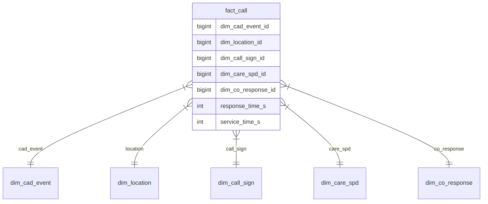

# 📞 Seattle 911 Call Data ETL Pipeline | PySpark + Snowflake

Batch ETL pipeline that processes raw Seattle emergency call data (5M+ records) into an optimized star schema. Features:

• 🚀 PySpark data transformations  
• ❄️ Snowflake data warehouse loading  
• ⭐ Auto-generated star schema  
• 🛡️ Built-in data quality checks  
• 📊 Parquet + Snowflake outputs

Handles all processing from raw CSV → analytics-ready dimensional model.

---

## 📌 Overview

Batch processing pipeline that transforms raw Seattle 911 call data into an analytical star schema, loading to both Parquet files and Snowflake.

## 🔧 Technical Stack

- **PySpark 3.5+** (Data processing)
- **Snowflake** (Data warehouse)
- **Python 3.8+** (Orchestration)
- **Parquet** (Storage format)

## 📂 Directory Structure

```bash
ETL_Pipeline_Batch/
├── config/
│   └── settings.py           # Configuration management
├── utils/
│   └── helpers.py            # Utility functions
├── extract.py                # Data ingestion
├── transform.py              # Data processing
├── load.py                   # Data loading
├── main.py                   # Pipeline entry point
├── Data/                     # Input CSV files
└── Parquet_files/            # Output Parquet files
```

## 🚀 Quick Start

### 1. Prerequisites

```bash
# Install Java (PySpark dependency)
sudo apt install openjdk-11-jdk  # Linux
brew install openjdk             # Mac
```

### 2. Environment Setup

```bash
git clone <your-repo>
cd ETL_Pipeline_Batch
python -m venv venv
source venv/bin/activate  # Linux/Mac
venv\Scripts\activate     # Windows
pip install -r requirements.txt
```

### 3. Configuration

Copy `.env.example` to `.env`

Add your Snowflake credentials:

```ini
SNOWFLAKE_ACCOUNT=your_account
SNOWFLAKE_USER=your_user
SNOWFLAKE_PASSWORD=your_password
```

### 4. Run Pipeline

```bash
python main.py
```

## ⚙️ Pipeline Stages

| Stage     | Description                   | Key Features                                                                         |
| --------- | ----------------------------- | ------------------------------------------------------------------------------------ |
| Extract   | Reads CSV from `Data/`        | - Memory-safe sampling <br> - Schema inference                                       |
| Transform | Creates star schema           | - Timestamp normalization <br> - Surrogate key generation <br> - Data quality checks |
| Load      | Writes to Parquet + Snowflake | - Partitioned output <br> - Auto schema inference                                    |

## 🌟 Star Schema Diagram



## 🛠️ Operational Commands

### Run with Sample Data

```bash
python main.py --sample
```

### Skip Snowflake Load

```bash
python main.py --no-snowflake
```

### View Spark UI

Access at [http://localhost:4040](http://localhost:4040) during pipeline execution

## 📊 Data Validation

Pipeline performs these checks automatically:

- No nulls in key fields (`cad_event_number`, `call_sign_dispatch_id`)
- All timestamps are chronologically valid
- Response times are positive numbers
- 100% referential integrity in star schema

## 📝 License

Apache 2.0 - See LICENSE for details

---

### 🔄 Attribution

This project, **ETL Pipeline: Seattle Call Data Processing**, provides a batch processing pipeline that transforms raw Seattle 911 call data into a clean star schema for analytics. It uses PySpark for ETL, outputs Parquet files, and supports loading into Snowflake. The code is licensed under the Apache 2.0 license.

---

### 📘 How to Use:

1. Copy this entire content
2. Create a new `README.md` file in your project root
3. Paste and save
4. Customize any sections marked with `<>`
